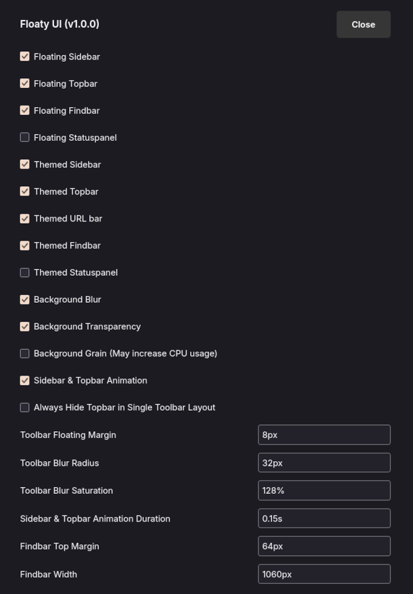
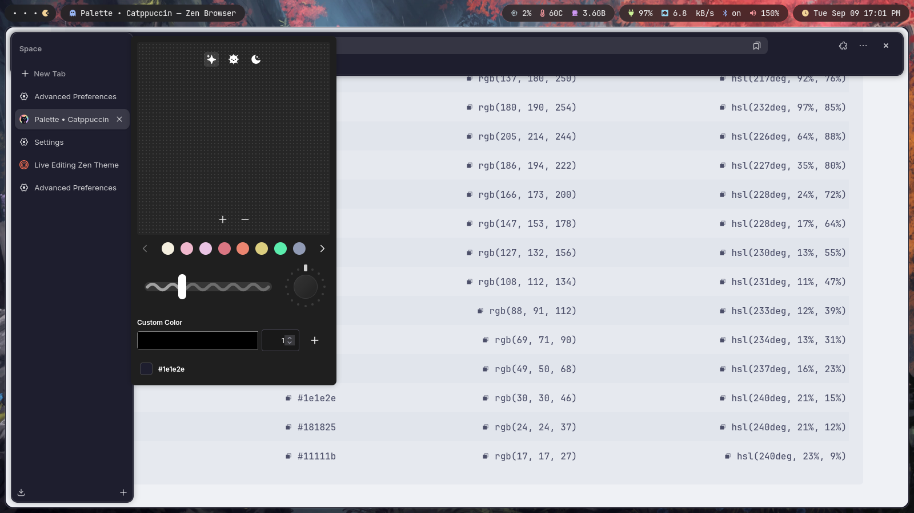

# Floaty UI <a href="https://github.com/moktavizen/floaty-ui?tab=readme-ov-file#floaty-ui-"></a>

Compact Mode, but it floats.

> [!NOTE]
> - This mod only works in Compact Mode

## Features

- Floating Sidebar, Topbar, Findbar, Statuspanel
- Themed Sidebar, Topbar, URL bar, Findbar, Statuspanel
- Supports Zen Color Picker
- Supports background blur
- Smaller Zen Notifications
- Works on all 3 layout, Single Toolbar, Multiple Toolbars, Collapsed Toolbar
- Lots of settings to customize

## `about:config`

- Conflict: Background blur is not compatible with `browser.tabs.allow_transparent_browser`
- Optional: Set `zen.theme.content-element-separation` to 1 to enhance the floating feel

## Settings



## Install

### Sine

1. Install [Sine](https://github.com/CosmoCreeper/Sine)
2. Go to `Settings > Sine Mods` search for `floaty ui` and click install

### Zen Mods

Waiting for https://github.com/zen-browser/theme-store/pull/1585

### Manual

1. Export your mod list from `Settings > Zen Mods > Export Mods`
2. Edit the exported JSON and add

    ```json
    "mod-floaty-ui": {
      "id": "mod-floaty-ui",
      "name": "Floaty UI",
      "description": "Compact Mode, but it floats. Supports Zen Color Picker and background blur.",
      "homepage": "https://github.com/moktavizen/floaty-ui",
      "style": "https://raw.githubusercontent.com/moktavizen/floaty-ui/refs/heads/main/chrome.css",
      "preferences": "https://raw.githubusercontent.com/moktavizen/floaty-ui/refs/heads/main/preferences.json",
      "readme": "https://raw.githubusercontent.com/moktavizen/floaty-ui/refs/heads/main/README.md",
      "image": "https://raw.githubusercontent.com/moktavizen/floaty-ui/refs/heads/main/media/preview-store.png",
      "author": "moktavizen",
      "version": "1.0.1",
      "tags": [],
      "createdAt": "2025-06-29",
      "updatedAt": "2025-06-29",
      "enabled": false
    }
    ```

    The structure should look like this

    ```json
    {
      "other-mods": {
        // other mods info
      }, // don't forget the comma before
      "mod-floaty-ui": {
        // floaty-ui info
      }
    }
    ```

3. Go to <code>[profile folder](https://docs.zen-browser.app/guides/live-editing#step-1-access-the-profile-folder)</code> and replace the content of `zen-theme.json` with the edited JSON
4. Go to <code>[chrome folder](https://docs.zen-browser.app/guides/live-editing#step-2-create-the-chrome-folder) > zen-themes</code> and create a folder called `mod-floaty-ui`, and place `chrome.css` and `preferences.json` inside of it
5. Restart Zen Browser and enable it from `Settings > Zen Mods`

## Uninstall

1. Go to `Settings > Zen/Sine Mods > Remove`

## FAQ

### How to use custom color scheme?

1. Disable standalone color scheme mod
2. Find the hex color for the color scheme, for example, [Catppuccin Mocha](https://catppuccin.com/palette/#:~:text=Mocha,-Color)
3. Go to `about:config`
   - Set `zen.theme.accent-color` to `#8aadf4` (Catppuccin Blue)
   - Set `zen.theme.gradient.show-custom-colors` to `true`
4. Right click in sidebar > Edit Theme > Set custom color to `#1e1e2e` (Catppuccin Base) > Set the transparency > Click plus icon
5. Results 
